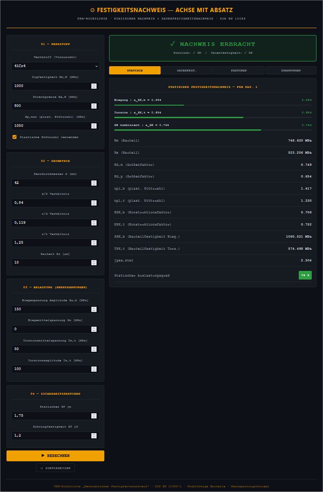
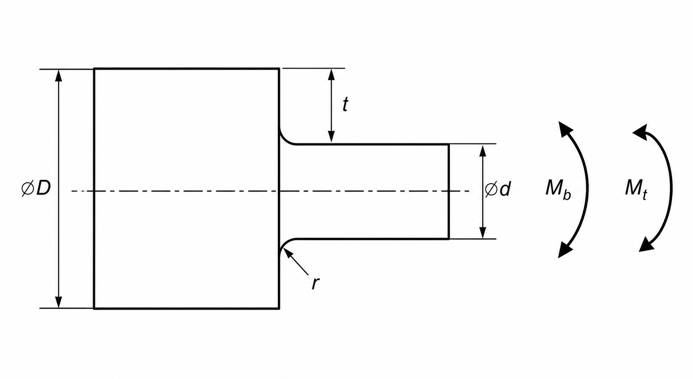

# ⚙ Festigkeitsnachweis FKM — Achse mit Absatz

Interaktive Web-App zur Berechnung des statischen Festigkeitsnachweises und Dauerfestigkeitsnachweises für stabförmige Bauteile (Achsen/Wellen mit Absatz) nach der **FKM-Richtlinie** und **DIN EN 10083-1**.

🔗 **Live-Demo:** [https://noeljoan.github.io/festigkeitsnachweis/)

---

## Screenshot

## Inhalt

- [Funktionsumfang](#funktionsumfang)
- [Berechnungsgrundlagen](#berechnungsgrundlagen)
- [Werkstoffvorauswahl](#werkstoffvorauswahl)

---

## Funktionsumfang

- **Statischer Festigkeitsnachweis** (FKM Kap. 1) mit plastischer Stützzahl
- **Dauerfestigkeitsnachweis** (FKM Kap. 2) mit Mittelspannungseinfluss
- Berechnung von Kerbwirkungs-, Rauheits- und Konstruktionsfaktoren
- Auslastungsgrade nach von-Mises (GH-Hypothese) für kombinierte Biegung + Torsion
- Technologischer Größenfaktor (Kd,m / Kd,p) nach Bauteilabmessung
- Werkstoffvorauswahl mit Kennwerten nach DIN EN 10083-1
- Ergebnisanzeige in 4 Tabs: Statisch · Dauerfestigkeit · Faktoren · Spannungen

---

## Berechnungsgrundlagen

| Nachweis | Norm / Quelle |
|---|---|
| Statischer Festigkeitsnachweis | FKM-Richtlinie, Kap. 1 |
| Dauerfestigkeitsnachweis | FKM-Richtlinie, Kap. 2 |
| Werkstoffkennwerte | DIN EN 10083-1 (Vergütungsstahl) |
| Kerbwirkungszahl (rechnerisch) | FKM Tab. 2.3.2 / 2.3.3, Gl. 2.3.10 |
| Mittelspannungsempfindlichkeit | FKM Gl. 2.4.34 |
| Sicherheitsfaktoren | FKM Tab. 1.5.1 / 2.5.1 |

Anwendungsbereich: **stabförmige Bauteile**, Nennspannungskonzept, Überlastungsfall F2, zyklisch konstante Belastung (Umlaufbiegung + Torsion).

---

## Werkstoffvorauswahl

| Werkstoff | Rm,N [MPa] | Re,N [MPa] |
|---|---|---|
| 41Cr4 | 1000 | 800 |
| 42CrMo4 | 1100 | 900 |
| 34CrMo4 | 1000 | 800 |
| C45 | 700 | 490 |
| 34CrNiMo6 | 1200 | 1000 |
| 30CrNiMo8 | 1250 | 1050 |
| 37Cr4 | 950 | 750 |

Benutzerdefinierte Werkstoffkennwerte sind ebenfalls eingebbar.

---

## Anwendungsbeispiel

Die Standardwerte entsprechen dem Beispiel **6.1 „Achse mit Absatz"** aus der FKM-Richtlinie:

| Parameter | Wert |
|---|---|
| Werkstoff | 41Cr4 (DIN EN 10083) |
| d / D | 42 mm / 50 mm |
| r/d | 0,119 |
| Biegespannung Sa,b | ±150 MPa |
| Torsion Tm,t ± Ta,t | 50 ± 100 MPa |
| Sicherheit jm / jD | 1,75 / 1,2 |

Ergebnis: statischer Auslastungsgrad **47 %**, zyklischer Auslastungsgrad **≈ 102 %** (Nachweis annähernd erbracht).

---

## Lizenz

MIT [LICENSE](https://github.com/noeljoan/weight-and-balance/blob/main/LICENSE) — frei verwendbar und erweiterbar.
 
---

* Berechnung nach FKM-Richtlinie (6. Auflage)*
